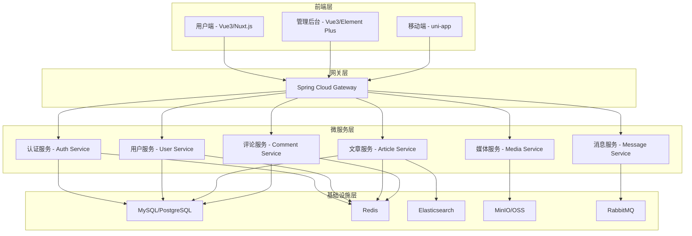
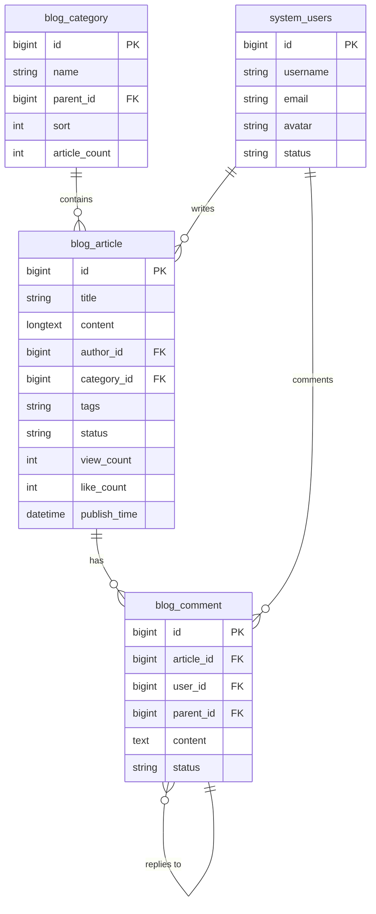

<!--
 * @Description: MicroBlog 源码文档
 * @Author: xunzhaotech
 * @Email: luyb@xunzhaotech.com
 * @QQ: 1525572900
 * @Date: 2025-08-25 16:00:00
 * @LastEditTime: 2025-08-25 16:00:00
 * @LastEditors: xunzhaotech
-->

# MicroBlog 源码文档

## 项目概述

MicroBlog 是基于 MicroDesign 微服务架构的现代化博客系统，采用前后端分离设计，提供完整的博客创作、管理和社交功能。项目采用最新的技术栈，具有高可扩展性、高性能和丰富的功能特性。

## 🚀 快速开始

### GitHub 仓库

| 仓库 | 地址 | 描述 |
|------|------|------|
| **后端项目** | [https://github.com/micro-design-awesome/micro-blog](https://github.com/micro-design-awesome/micro-blog) | Spring Boot + Spring Cloud 微服务架构 |
| **前端管理后台** | [https://github.com/micro-design-awesome/micro-blog-admin](https://github.com/micro-design-awesome/micro-blog-admin) | Vue3 + Element Plus 管理后台 |
| **前端用户端** | [https://github.com/micro-design-awesome/micro-blog-web](https://github.com/micro-design-awesome/micro-blog-web) | Vue3 + Nuxt.js 用户端 |
| **移动端** | [https://github.com/micro-design-awesome/micro-blog-app](https://github.com/micro-design-awesome/micro-blog-app) | uni-app 多端应用 |

### 技术架构图



## 📁 项目结构

### 后端项目结构

```
micro-blog/
├── micro-dependencies/           # 依赖管理
├── micro-framework/             # 框架核心
│   ├── micro-common/           # 公共模块
│   ├── micro-security/         # 安全框架
│   ├── micro-web/             # Web 配置
│   └── micro-mybatis/         # 数据库配置
├── micro-gateway/              # 服务网关
├── micro-module-system/        # 系统管理模块
│   ├── micro-module-system-api/
│   ├── micro-module-system-biz/
│   └── micro-module-system-server/
├── micro-module-blog/          # 博客核心模块
│   ├── micro-module-blog-api/
│   ├── micro-module-blog-biz/
│   └── micro-module-blog-server/
├── micro-module-user/          # 用户管理模块
├── micro-module-comment/       # 评论管理模块
├── micro-module-media/         # 媒体管理模块
├── micro-module-search/        # 搜索服务模块
├── micro-ui/                  # 前端项目集合
│   ├── micro-ui-admin/        # 管理后台
│   └── micro-ui-web/          # 用户端
├── sql/                       # 数据库脚本
└── docker-compose.yml         # Docker 编排文件
```

### 前端项目结构

```
micro-blog-web/                 # 用户端项目
├── assets/                    # 静态资源
├── components/                # 公共组件
│   ├── Article/              # 文章相关组件
│   ├── Comment/              # 评论组件
│   ├── Layout/               # 布局组件
│   └── Common/               # 通用组件
├── pages/                    # 页面组件
│   ├── index.vue            # 首页
│   ├── article/             # 文章相关页面
│   ├── category/            # 分类页面
│   ├── tag/                 # 标签页面
│   └── user/                # 用户相关页面
├── plugins/                  # 插件配置
├── store/                   # 状态管理
├── utils/                   # 工具函数
└── nuxt.config.js          # Nuxt 配置

micro-blog-admin/              # 管理后台项目
├── src/
│   ├── api/                 # API 接口
│   ├── components/          # 公共组件
│   ├── layout/             # 布局组件
│   ├── router/             # 路由配置
│   ├── store/              # 状态管理
│   ├── utils/              # 工具函数
│   └── views/              # 页面组件
│       ├── article/        # 文章管理
│       ├── comment/        # 评论管理
│       ├── user/           # 用户管理
│       ├── category/       # 分类管理
│       └── system/         # 系统管理
├── public/
└── package.json
```

## 🔧 核心模块详解

### 1. 认证授权模块 (micro-module-system)

#### 核心组件

**用户管理服务**
```java
@RestController
@RequestMapping("/system/user")
public class UserController {
    
    @Autowired
    private UserService userService;
    
    @GetMapping("/profile")
    public Result<UserProfileVO> getUserProfile() {
        Long userId = SecurityFrameworkUtils.getLoginUserId();
        UserProfileVO profile = userService.getUserProfile(userId);
        return Result.success(profile);
    }
    
    @PostMapping("/update-profile")
    public Result<Boolean> updateProfile(@RequestBody @Valid UserProfileUpdateReqVO reqVO) {
        userService.updateUserProfile(SecurityFrameworkUtils.getLoginUserId(), reqVO);
        return Result.success(true);
    }
}
```

**权限管理**
```java
@Component
public class PermissionService {
    
    @Autowired
    private RedisTemplate<String, Object> redisTemplate;
    
    public boolean hasPermission(Long userId, String permission) {
        String key = String.format("user:permission:%d", userId);
        Set<String> permissions = (Set<String>) redisTemplate.opsForValue().get(key);
        return permissions != null && permissions.contains(permission);
    }
}
```

### 2. 博客核心模块 (micro-module-blog)

#### 文章管理服务

**文章实体类**
```java
@Entity
@Table(name = "blog_article")
public class ArticleDO extends BaseDO {
    
    @Id
    @GeneratedValue(strategy = GenerationType.IDENTITY)
    private Long id;
    
    @Column(nullable = false)
    private String title;
    
    @Column(columnDefinition = "TEXT")
    private String content;
    
    @Column(columnDefinition = "TEXT")
    private String contentHtml;
    
    @Column(nullable = false)
    private Long authorId;
    
    @Column
    private Long categoryId;
    
    @Column
    private String tags;
    
    @Column
    private String coverImage;
    
    @Enumerated(EnumType.STRING)
    private ArticleStatus status;
    
    @Column
    private Integer viewCount = 0;
    
    @Column
    private Integer likeCount = 0;
    
    @Column
    private Integer commentCount = 0;
    
    // getters and setters...
}
```

**文章服务接口**
```java
@Service
public class ArticleServiceImpl implements ArticleService {
    
    @Autowired
    private ArticleMapper articleMapper;
    
    @Autowired
    private RedisTemplate<String, Object> redisTemplate;
    
    @Autowired
    private ElasticsearchTemplate elasticsearchTemplate;
    
    @Override
    @Transactional
    public Long createArticle(ArticleCreateReqVO reqVO) {
        // 1. 创建文章实体
        ArticleDO article = ArticleConvert.INSTANCE.convert(reqVO);
        article.setAuthorId(SecurityFrameworkUtils.getLoginUserId());
        article.setStatus(ArticleStatus.DRAFT);
        
        // 2. 保存到数据库
        articleMapper.insert(article);
        
        // 3. 同步到 Elasticsearch
        syncToElasticsearch(article);
        
        // 4. 清除相关缓存
        clearArticleCache(article.getId());
        
        return article.getId();
    }
    
    @Override
    public ArticleVO getArticleById(Long id) {
        // 1. 从缓存获取
        String cacheKey = String.format("article:%d", id);
        ArticleVO cached = (ArticleVO) redisTemplate.opsForValue().get(cacheKey);
        if (cached != null) {
            return cached;
        }
        
        // 2. 从数据库获取
        ArticleDO article = articleMapper.selectById(id);
        if (article == null) {
            throw new ServiceException(ErrorCodeConstants.ARTICLE_NOT_EXISTS);
        }
        
        // 3. 转换为 VO
        ArticleVO articleVO = ArticleConvert.INSTANCE.convert(article);
        
        // 4. 缓存结果
        redisTemplate.opsForValue().set(cacheKey, articleVO, Duration.ofMinutes(30));
        
        return articleVO;
    }
    
    private void syncToElasticsearch(ArticleDO article) {
        ArticleDocument document = new ArticleDocument();
        document.setId(article.getId());
        document.setTitle(article.getTitle());
        document.setContent(article.getContent());
        document.setAuthorId(article.getAuthorId());
        document.setCategoryId(article.getCategoryId());
        document.setTags(article.getTags());
        document.setCreateTime(article.getCreateTime());
        
        elasticsearchTemplate.save(document);
    }
}
```

### 3. 评论系统模块 (micro-module-comment)

#### 多级评论实现

**评论实体**
```java
@Entity
@Table(name = "blog_comment")
public class CommentDO extends BaseDO {
    
    @Id
    @GeneratedValue(strategy = GenerationType.IDENTITY)
    private Long id;
    
    @Column(nullable = false)
    private Long articleId;
    
    @Column(nullable = false)
    private Long userId;
    
    @Column
    private Long parentId; // 父评论ID，支持多级评论
    
    @Column
    private Long replyToUserId; // 回复的用户ID
    
    @Column(nullable = false, columnDefinition = "TEXT")
    private String content;
    
    @Column
    private Integer likeCount = 0;
    
    @Enumerated(EnumType.STRING)
    private CommentStatus status;
    
    // getters and setters...
}
```

**评论服务**
```java
@Service
public class CommentServiceImpl implements CommentService {
    
    @Override
    public PageResult<CommentVO> getCommentPage(CommentPageReqVO reqVO) {
        // 1. 获取顶级评论
        PageResult<CommentDO> pageResult = commentMapper.selectPage(reqVO);
        
        // 2. 获取子评论
        List<CommentVO> comments = pageResult.getList().stream()
            .map(this::convertToVO)
            .collect(Collectors.toList());
            
        // 3. 填充子评论
        for (CommentVO comment : comments) {
            List<CommentVO> replies = getCommentReplies(comment.getId());
            comment.setReplies(replies);
        }
        
        return new PageResult<>(comments, pageResult.getTotal());
    }
    
    private List<CommentVO> getCommentReplies(Long parentId) {
        List<CommentDO> replies = commentMapper.selectListByParentId(parentId);
        return replies.stream()
            .map(this::convertToVO)
            .collect(Collectors.toList());
    }
}
```

### 4. 搜索服务模块 (micro-module-search)

#### Elasticsearch 集成

**搜索文档**
```java
@Document(indexName = "blog_articles")
public class ArticleDocument {
    
    @Id
    private Long id;
    
    @Field(type = FieldType.Text, analyzer = "ik_max_word", searchAnalyzer = "ik_smart")
    private String title;
    
    @Field(type = FieldType.Text, analyzer = "ik_max_word", searchAnalyzer = "ik_smart")
    private String content;
    
    @Field(type = FieldType.Keyword)
    private String tags;
    
    @Field(type = FieldType.Long)
    private Long authorId;
    
    @Field(type = FieldType.Long)
    private Long categoryId;
    
    @Field(type = FieldType.Date, format = DateFormat.date_time)
    private LocalDateTime createTime;
    
    // getters and setters...
}
```

**搜索服务**
```java
@Service
public class SearchServiceImpl implements SearchService {
    
    @Autowired
    private ElasticsearchRestTemplate elasticsearchTemplate;
    
    @Override
    public PageResult<ArticleSearchVO> searchArticles(ArticleSearchReqVO reqVO) {
        // 构建查询条件
        BoolQueryBuilder queryBuilder = QueryBuilders.boolQuery();
        
        // 关键词搜索
        if (StrUtil.isNotBlank(reqVO.getKeyword())) {
            queryBuilder.must(QueryBuilders.multiMatchQuery(reqVO.getKeyword())
                .field("title", 2.0f) // 标题权重更高
                .field("content", 1.0f)
                .type(MultiMatchQueryBuilder.Type.BEST_FIELDS));
        }
        
        // 分类过滤
        if (reqVO.getCategoryId() != null) {
            queryBuilder.filter(QueryBuilders.termQuery("categoryId", reqVO.getCategoryId()));
        }
        
        // 标签过滤
        if (StrUtil.isNotBlank(reqVO.getTag())) {
            queryBuilder.filter(QueryBuilders.termQuery("tags", reqVO.getTag()));
        }
        
        // 构建搜索请求
        NativeSearchQuery searchQuery = new NativeSearchQueryBuilder()
            .withQuery(queryBuilder)
            .withPageable(PageRequest.of(reqVO.getPageNo() - 1, reqVO.getPageSize()))
            .withSort(SortBuilders.scoreSort().order(SortOrder.DESC))
            .withSort(SortBuilders.fieldSort("createTime").order(SortOrder.DESC))
            .withHighlightFields(
                new HighlightBuilder.Field("title").preTags("<em>").postTags("</em>"),
                new HighlightBuilder.Field("content").preTags("<em>").postTags("</em>")
            )
            .build();
        
        // 执行搜索
        SearchHits<ArticleDocument> searchHits = elasticsearchTemplate.search(searchQuery, ArticleDocument.class);
        
        // 转换结果
        List<ArticleSearchVO> articles = searchHits.getSearchHits().stream()
            .map(this::convertToSearchVO)
            .collect(Collectors.toList());
        
        return new PageResult<>(articles, searchHits.getTotalHits());
    }
    
    private ArticleSearchVO convertToSearchVO(SearchHit<ArticleDocument> hit) {
        ArticleDocument document = hit.getContent();
        ArticleSearchVO vo = ArticleConvert.INSTANCE.convert(document);
        
        // 设置高亮内容
        Map<String, List<String>> highlightFields = hit.getHighlightFields();
        if (highlightFields.containsKey("title")) {
            vo.setTitle(highlightFields.get("title").get(0));
        }
        if (highlightFields.containsKey("content")) {
            vo.setContentSnippet(highlightFields.get("content").get(0));
        }
        
        return vo;
    }
}
```

## 🗄️ 数据库设计

### 核心表结构

#### 文章表 (blog_article)

```sql
CREATE TABLE `blog_article` (
  `id` bigint NOT NULL AUTO_INCREMENT COMMENT '文章ID',
  `title` varchar(200) NOT NULL COMMENT '文章标题',
  `content` longtext COMMENT '文章内容(Markdown)',
  `content_html` longtext COMMENT '文章内容(HTML)',
  `summary` text COMMENT '文章摘要',
  `author_id` bigint NOT NULL COMMENT '作者ID',
  `category_id` bigint DEFAULT NULL COMMENT '分类ID',
  `tags` varchar(500) DEFAULT NULL COMMENT '标签(逗号分隔)',
  `cover_image` varchar(500) DEFAULT NULL COMMENT '封面图片',
  `status` varchar(20) NOT NULL DEFAULT 'DRAFT' COMMENT '文章状态',
  `view_count` int DEFAULT '0' COMMENT '浏览次数',
  `like_count` int DEFAULT '0' COMMENT '点赞次数',
  `comment_count` int DEFAULT '0' COMMENT '评论次数',
  `is_top` tinyint(1) DEFAULT '0' COMMENT '是否置顶',
  `is_recommend` tinyint(1) DEFAULT '0' COMMENT '是否推荐',
  `publish_time` datetime DEFAULT NULL COMMENT '发布时间',
  `creator` varchar(64) DEFAULT '' COMMENT '创建者',
  `create_time` datetime NOT NULL DEFAULT CURRENT_TIMESTAMP COMMENT '创建时间',
  `updater` varchar(64) DEFAULT '' COMMENT '更新者',
  `update_time` datetime NOT NULL DEFAULT CURRENT_TIMESTAMP ON UPDATE CURRENT_TIMESTAMP COMMENT '更新时间',
  `deleted` bit(1) NOT NULL DEFAULT b'0' COMMENT '是否删除',
  `tenant_id` bigint NOT NULL DEFAULT '0' COMMENT '租户编号',
  PRIMARY KEY (`id`),
  KEY `idx_author_id` (`author_id`),
  KEY `idx_category_id` (`category_id`),
  KEY `idx_status` (`status`),
  KEY `idx_publish_time` (`publish_time`),
  KEY `idx_create_time` (`create_time`)
) ENGINE=InnoDB DEFAULT CHARSET=utf8mb4 COLLATE=utf8mb4_unicode_ci COMMENT='博客文章表';
```

#### 评论表 (blog_comment)

```sql
CREATE TABLE `blog_comment` (
  `id` bigint NOT NULL AUTO_INCREMENT COMMENT '评论ID',
  `article_id` bigint NOT NULL COMMENT '文章ID',
  `user_id` bigint NOT NULL COMMENT '评论用户ID',
  `parent_id` bigint DEFAULT NULL COMMENT '父评论ID',
  `reply_to_user_id` bigint DEFAULT NULL COMMENT '回复用户ID',
  `content` text NOT NULL COMMENT '评论内容',
  `like_count` int DEFAULT '0' COMMENT '点赞次数',
  `status` varchar(20) NOT NULL DEFAULT 'APPROVED' COMMENT '评论状态',
  `ip_address` varchar(50) DEFAULT NULL COMMENT 'IP地址',
  `user_agent` varchar(500) DEFAULT NULL COMMENT '用户代理',
  `creator` varchar(64) DEFAULT '' COMMENT '创建者',
  `create_time` datetime NOT NULL DEFAULT CURRENT_TIMESTAMP COMMENT '创建时间',
  `updater` varchar(64) DEFAULT '' COMMENT '更新者',
  `update_time` datetime NOT NULL DEFAULT CURRENT_TIMESTAMP ON UPDATE CURRENT_TIMESTAMP COMMENT '更新时间',
  `deleted` bit(1) NOT NULL DEFAULT b'0' COMMENT '是否删除',
  `tenant_id` bigint NOT NULL DEFAULT '0' COMMENT '租户编号',
  PRIMARY KEY (`id`),
  KEY `idx_article_id` (`article_id`),
  KEY `idx_user_id` (`user_id`),
  KEY `idx_parent_id` (`parent_id`),
  KEY `idx_create_time` (`create_time`)
) ENGINE=InnoDB DEFAULT CHARSET=utf8mb4 COLLATE=utf8mb4_unicode_ci COMMENT='博客评论表';
```

#### 分类表 (blog_category)

```sql
CREATE TABLE `blog_category` (
  `id` bigint NOT NULL AUTO_INCREMENT COMMENT '分类ID',
  `name` varchar(50) NOT NULL COMMENT '分类名称',
  `description` varchar(200) DEFAULT NULL COMMENT '分类描述',
  `parent_id` bigint DEFAULT NULL COMMENT '父分类ID',
  `sort` int DEFAULT '0' COMMENT '排序',
  `icon` varchar(100) DEFAULT NULL COMMENT '分类图标',
  `cover_image` varchar(500) DEFAULT NULL COMMENT '分类封面',
  `article_count` int DEFAULT '0' COMMENT '文章数量',
  `status` varchar(20) NOT NULL DEFAULT 'ENABLE' COMMENT '状态',
  `creator` varchar(64) DEFAULT '' COMMENT '创建者',
  `create_time` datetime NOT NULL DEFAULT CURRENT_TIMESTAMP COMMENT '创建时间',
  `updater` varchar(64) DEFAULT '' COMMENT '更新者',
  `update_time` datetime NOT NULL DEFAULT CURRENT_TIMESTAMP ON UPDATE CURRENT_TIMESTAMP COMMENT '更新时间',
  `deleted` bit(1) NOT NULL DEFAULT b'0' COMMENT '是否删除',
  `tenant_id` bigint NOT NULL DEFAULT '0' COMMENT '租户编号',
  PRIMARY KEY (`id`),
  KEY `idx_parent_id` (`parent_id`),
  KEY `idx_sort` (`sort`)
) ENGINE=InnoDB DEFAULT CHARSET=utf8mb4 COLLATE=utf8mb4_unicode_ci COMMENT='博客分类表';
```

### 数据库关系图



## 🔌 API 接口文档

### 文章管理 API

#### 获取文章列表

```http
GET /api/articles
```

**请求参数:**
```json
{
  "pageNo": 1,
  "pageSize": 10,
  "categoryId": 1,
  "tag": "技术",
  "status": "PUBLISHED",
  "keyword": "搜索关键词"
}
```

**响应结果:**
```json
{
  "code": 0,
  "message": "操作成功",
  "data": {
    "list": [
      {
        "id": 1,
        "title": "文章标题",
        "summary": "文章摘要",
        "coverImage": "封面图片URL",
        "author": {
          "id": 1,
          "username": "作者名",
          "avatar": "头像URL"
        },
        "category": {
          "id": 1,
          "name": "分类名称"
        },
        "tags": ["标签1", "标签2"],
        "viewCount": 100,
        "likeCount": 50,
        "commentCount": 20,
        "publishTime": "2025-08-25T10:00:00"
      }
    ],
    "total": 100
  }
}
```

#### 创建文章

```http
POST /api/articles
Authorization: Bearer {token}
```

**请求体:**
```json
{
  "title": "文章标题",
  "content": "文章内容(Markdown)",
  "summary": "文章摘要",
  "categoryId": 1,
  "tags": ["标签1", "标签2"],
  "coverImage": "封面图片URL",
  "status": "DRAFT"
}
```

#### 获取文章详情

```http
GET /api/articles/{id}
```

**响应结果:**
```json
{
  "code": 0,
  "message": "操作成功",
  "data": {
    "id": 1,
    "title": "文章标题",
    "content": "文章内容(Markdown)",
    "contentHtml": "文章内容(HTML)",
    "summary": "文章摘要",
    "author": {
      "id": 1,
      "username": "作者名",
      "avatar": "头像URL"
    },
    "category": {
      "id": 1,
      "name": "分类名称"
    },
    "tags": ["标签1", "标签2"],
    "coverImage": "封面图片URL",
    "viewCount": 100,
    "likeCount": 50,
    "commentCount": 20,
    "publishTime": "2025-08-25T10:00:00",
    "createTime": "2025-08-25T10:00:00"
  }
}
```

### 评论管理 API

#### 获取评论列表

```http
GET /api/comments?articleId={articleId}&pageNo=1&pageSize=10
```

#### 发表评论

```http
POST /api/comments
Authorization: Bearer {token}
```

**请求体:**
```json
{
  "articleId": 1,
  "content": "评论内容",
  "parentId": null,
  "replyToUserId": null
}
```

## ⚙️ 开发环境配置

### 环境要求

| 工具 | 版本要求 | 说明 |
|------|----------|------|
| **JDK** | 17+ | Java 运行环境 |
| **Node.js** | 16+ | 前端运行环境 |
| **MySQL** | 8.0+ | 主数据库 |
| **Redis** | 6.0+ | 缓存数据库 |
| **Elasticsearch** | 7.x+ | 搜索引擎 |
| **Maven** | 3.6+ | Java 项目管理 |
| **pnpm** | 7.0+ | 前端包管理器 |

### 后端启动配置

#### 1. 克隆项目

```bash
# 克隆后端项目
git clone https://github.com/micro-design-awesome/micro-blog.git
cd micro-blog

# 克隆前端项目
git clone https://github.com/micro-design-awesome/micro-blog-admin.git
git clone https://github.com/micro-design-awesome/micro-blog-web.git
```

#### 2. 数据库初始化

```bash
# 创建数据库
mysql -u root -p
CREATE DATABASE micro_blog DEFAULT CHARACTER SET utf8mb4 COLLATE utf8mb4_unicode_ci;

# 导入表结构和数据
mysql -u root -p micro_blog < sql/mysql/micro-blog-schema.sql
mysql -u root -p micro_blog < sql/mysql/micro-blog-data.sql
```

#### 3. 配置文件修改

**application-dev.yml**
```yaml
spring:
  datasource:
    url: jdbc:mysql://127.0.0.1:3306/micro_blog?useUnicode=true&characterEncoding=UTF-8&autoReconnect=true&serverTimezone=Asia/Shanghai&allowPublicKeyRetrieval=true&nullCatalogMeansCurrent=true
    username: root
    password: password
    
  data:
    redis:
      host: 127.0.0.1
      port: 6379
      password: 
      
  elasticsearch:
    uris: http://127.0.0.1:9200
    username: 
    password: 
    
# MinIO 配置
minio:
  endpoint: http://127.0.0.1:9000
  access-key: minioadmin
  secret-key: minioadmin
  bucket-name: micro-blog
```

#### 4. 启动服务

```bash
# 启动网关服务
cd micro-gateway
mvn spring-boot:run

# 启动系统服务
cd micro-module-system/micro-module-system-server
mvn spring-boot:run

# 启动博客服务
cd micro-module-blog/micro-module-blog-server
mvn spring-boot:run
```

### 前端启动配置

#### 管理后台启动

```bash
cd micro-blog-admin

# 安装依赖
pnpm install

# 启动开发服务器
pnpm run dev

# 构建生产版本
pnpm run build
```

#### 用户端启动

```bash
cd micro-blog-web

# 安装依赖
pnpm install

# 启动开发服务器
pnpm run dev

# 构建生产版本
pnpm run build
```

### Docker 快速部署

#### docker-compose.yml

```yaml
version: '3.8'

services:
  # MySQL 数据库
  mysql:
    image: mysql:8.0
    container_name: micro-blog-mysql
    environment:
      MYSQL_ROOT_PASSWORD: root123
      MYSQL_DATABASE: micro_blog
    ports:
      - "3306:3306"
    volumes:
      - mysql_data:/var/lib/mysql
      - ./sql/mysql:/docker-entrypoint-initdb.d
    networks:
      - micro-blog-network

  # Redis 缓存
  redis:
    image: redis:6.2-alpine
    container_name: micro-blog-redis
    ports:
      - "6379:6379"
    volumes:
      - redis_data:/data
    networks:
      - micro-blog-network

  # Elasticsearch
  elasticsearch:
    image: elasticsearch:7.17.0
    container_name: micro-blog-es
    environment:
      - discovery.type=single-node
      - "ES_JAVA_OPTS=-Xms512m -Xmx512m"
    ports:
      - "9200:9200"
      - "9300:9300"
    volumes:
      - es_data:/usr/share/elasticsearch/data
    networks:
      - micro-blog-network

  # MinIO 对象存储
  minio:
    image: minio/minio:latest
    container_name: micro-blog-minio
    command: server /data --console-address ":9001"
    environment:
      MINIO_ACCESS_KEY: minioadmin
      MINIO_SECRET_KEY: minioadmin
    ports:
      - "9000:9000"
      - "9001:9001"
    volumes:
      - minio_data:/data
    networks:
      - micro-blog-network

  # 后端服务
  backend:
    build: .
    container_name: micro-blog-backend
    environment:
      SPRING_PROFILES_ACTIVE: docker
    ports:
      - "8080:8080"
    depends_on:
      - mysql
      - redis
      - elasticsearch
    networks:
      - micro-blog-network

  # 前端服务
  frontend:
    build: ./micro-blog-web
    container_name: micro-blog-frontend
    ports:
      - "3000:3000"
    depends_on:
      - backend
    networks:
      - micro-blog-network

volumes:
  mysql_data:
  redis_data:
  es_data:
  minio_data:

networks:
  micro-blog-network:
    driver: bridge
```

#### 一键部署

```bash
# 启动所有服务
docker-compose up -d

# 查看服务状态
docker-compose ps

# 查看日志
docker-compose logs -f backend

# 停止服务
docker-compose down
```

## 🚀 部署配置

### 生产环境部署

#### Nginx 配置

```nginx
upstream micro-blog-backend {
    server 127.0.0.1:8080;
    server 127.0.0.1:8081;
    server 127.0.0.1:8082;
}

upstream micro-blog-frontend {
    server 127.0.0.1:3000;
}

server {
    listen 80;
    server_name blog.example.com;
    
    # 重定向到 HTTPS
    return 301 https://$host$request_uri;
}

server {
    listen 443 ssl http2;
    server_name blog.example.com;
    
    # SSL 配置
    ssl_certificate /etc/nginx/ssl/blog.example.com.crt;
    ssl_certificate_key /etc/nginx/ssl/blog.example.com.key;
    
    # 前端静态资源
    location / {
        proxy_pass http://micro-blog-frontend;
        proxy_set_header Host $host;
        proxy_set_header X-Real-IP $remote_addr;
        proxy_set_header X-Forwarded-For $proxy_add_x_forwarded_for;
        proxy_set_header X-Forwarded-Proto $scheme;
    }
    
    # API 接口
    location /api/ {
        proxy_pass http://micro-blog-backend;
        proxy_set_header Host $host;
        proxy_set_header X-Real-IP $remote_addr;
        proxy_set_header X-Forwarded-For $proxy_add_x_forwarded_for;
        proxy_set_header X-Forwarded-Proto $scheme;
        
        # WebSocket 支持
        proxy_http_version 1.1;
        proxy_set_header Upgrade $http_upgrade;
        proxy_set_header Connection "upgrade";
    }
    
    # 静态文件缓存
    location ~* \.(js|css|png|jpg|jpeg|gif|ico|svg|woff|woff2|ttf|eot)$ {
        expires 1y;
        add_header Cache-Control "public, immutable";
    }
}
```

#### Jenkins CI/CD 配置

```groovy
pipeline {
    agent any
    
    environment {
        DOCKER_REGISTRY = 'registry.example.com'
        PROJECT_NAME = 'micro-blog'
    }
    
    stages {
        stage('代码检出') {
            steps {
                git branch: 'main', url: 'https://github.com/micro-design-awesome/micro-blog.git'
            }
        }
        
        stage('后端构建') {
            steps {
                sh 'mvn clean package -DskipTests'
            }
        }
        
        stage('前端构建') {
            steps {
                dir('micro-blog-web') {
                    sh 'pnpm install'
                    sh 'pnpm run build'
                }
            }
        }
        
        stage('Docker镜像构建') {
            parallel {
                stage('后端镜像') {
                    steps {
                        sh 'docker build -t ${DOCKER_REGISTRY}/${PROJECT_NAME}-backend:${BUILD_NUMBER} .'
                        sh 'docker push ${DOCKER_REGISTRY}/${PROJECT_NAME}-backend:${BUILD_NUMBER}'
                    }
                }
                stage('前端镜像') {
                    steps {
                        dir('micro-blog-web') {
                            sh 'docker build -t ${DOCKER_REGISTRY}/${PROJECT_NAME}-frontend:${BUILD_NUMBER} .'
                            sh 'docker push ${DOCKER_REGISTRY}/${PROJECT_NAME}-frontend:${BUILD_NUMBER}'
                        }
                    }
                }
            }
        }
        
        stage('部署到生产环境') {
            steps {
                sh '''
                    kubectl set image deployment/micro-blog-backend micro-blog-backend=${DOCKER_REGISTRY}/${PROJECT_NAME}-backend:${BUILD_NUMBER}
                    kubectl set image deployment/micro-blog-frontend micro-blog-frontend=${DOCKER_REGISTRY}/${PROJECT_NAME}-frontend:${BUILD_NUMBER}
                    kubectl rollout status deployment/micro-blog-backend
                    kubectl rollout status deployment/micro-blog-frontend
                '''
            }
        }
    }
    
    post {
        success {
            echo '部署成功！'
        }
        failure {
            echo '部署失败！'
        }
    }
}
```

## 🤝 贡献指南

### 开发规范

#### 代码规范

1. **Java 代码规范**
   - 遵循阿里巴巴 Java 开发手册
   - 使用 Spring Boot 官方最佳实践
   - 统一使用 Lombok 简化代码
   - 接口和实现类分离设计

2. **前端代码规范**
   - 遵循 Vue3 Composition API 规范
   - 使用 ESLint + Prettier 格式化代码
   - 统一使用 TypeScript 增强类型安全
   - 组件设计遵循单一职责原则

3. **数据库规范**
   - 表名使用小写字母和下划线
   - 字段名遵循驼峰命名法
   - 必须有创建时间和更新时间字段
   - 使用逻辑删除替代物理删除

#### 提交规范

使用 Conventional Commits 规范：

```bash
# 功能开发
git commit -m "feat: 新增文章评论功能"

# 问题修复
git commit -m "fix: 修复文章列表分页显示问题"

# 文档更新
git commit -m "docs: 更新 API 接口文档"

# 样式调整
git commit -m "style: 优化博客首页布局样式"

# 代码重构
git commit -m "refactor: 重构用户认证模块"

# 性能优化
git commit -m "perf: 优化文章搜索查询性能"

# 测试相关
git commit -m "test: 新增文章服务单元测试"
```

### 贡献流程

1. **Fork 项目**
   ```bash
   # Fork 到自己的 GitHub 账号
   # 克隆到本地
   git clone https://github.com/yourusername/micro-blog.git
   ```

2. **创建功能分支**
   ```bash
   git checkout -b feature/article-comment-system
   ```

3. **开发和测试**
   ```bash
   # 开发功能
   # 编写测试用例
   mvn test
   
   # 前端测试
   pnpm run test
   ```

4. **提交代码**
   ```bash
   git add .
   git commit -m "feat: 新增多级评论系统"
   git push origin feature/article-comment-system
   ```

5. **创建 Pull Request**
   - 详细描述功能实现
   - 附上测试截图或视频
   - 确保所有测试用例通过

### 问题反馈

如果您在使用过程中遇到问题，请通过以下方式反馈：

1. **GitHub Issues**: [https://github.com/micro-design-awesome/micro-blog/issues](https://github.com/micro-design-awesome/micro-blog/issues)
2. **技术支持邮箱**: microdesign@xunzhaotech.com
3. **QQ 技术群**: 1525572900

### 技术交流

欢迎加入我们的技术社区：

- **官方文档**: [https://docs.microdesign.com/blog](https://docs.microdesign.com/blog)
- **在线演示**: [https://blog.microdesign.com](https://blog.microdesign.com)
- **技术博客**: [https://blog.xunzhaotech.com](https://blog.xunzhaotech.com)

## 📄 开源协议

本项目基于 [MIT License](https://github.com/micro-design-awesome/micro-blog/blob/main/LICENSE) 开源协议，您可以自由使用、修改和分发代码。

## 🙏 致谢

感谢以下开源项目为 MicroBlog 提供的技术支持：

- [Spring Boot](https://spring.io/projects/spring-boot) - 强大的 Java 微服务框架
- [Spring Cloud Alibaba](https://spring.io/projects/spring-cloud-alibaba) - 微服务解决方案
- [Vue.js](https://vuejs.org/) - 渐进式 JavaScript 框架
- [Element Plus](https://element-plus.org/) - Vue 3 UI 组件库
- [MyBatis Plus](https://mp.baomidou.com/) - MyBatis 增强工具
- [Redis](https://redis.io/) - 高性能缓存数据库
- [Elasticsearch](https://www.elastic.co/) - 分布式搜索引擎

---

如果这个项目对您有帮助，请给我们一个 ⭐Star⭐，您的支持是我们持续改进的动力！