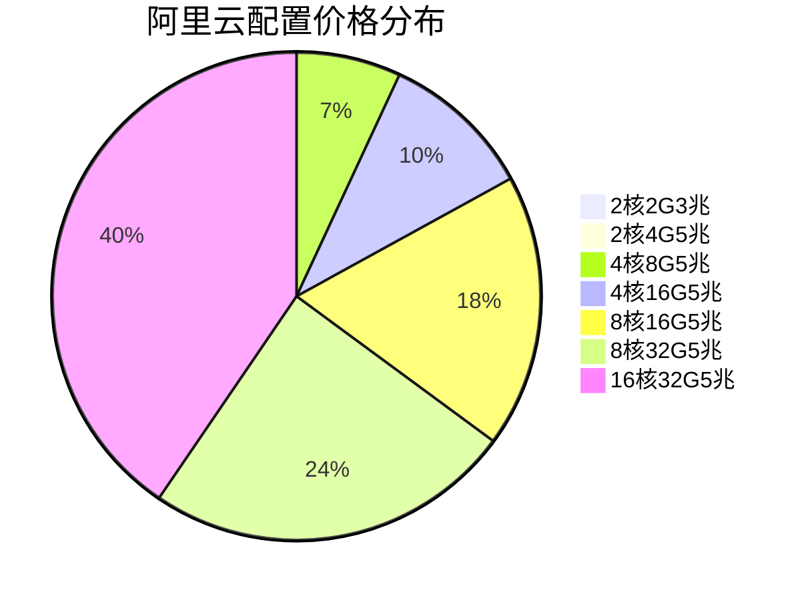

<!--
 * @Description: 
 * @Author: xunzhaotech
 * @Email: luyb@xunzhaotech.com
 * @QQ: 1525572900
 * @Date: 2025-07-31 17:40:46
 * @LastEditTime: 2025-07-31 17:49:06
 * @LastEditors: xunzhaotech
-->
# 阿里云价格配置表

## 阿里云服务器配置与价格

| 配置              | CPU  | 内存 | 带宽 | 购买时长 | 价格 (元) |
|-------------------|------|------|------|----------|----------|
| 2核2G3兆带宽1年     | 2核  | 2G   | 3兆  | 1年      | 99       |
| 2核4G5兆带宽1年     | 2核  | 4G   | 5兆  | 1年      | 199      |
| 4核8G5兆带宽2年     | 4核  | 8G   | 5兆  | 2年      | 2080     |
| 4核16G5兆带宽2年    | 4核  | 16G  | 5兆  | 2年      | 3029     |
| 8核16G5兆带宽2年    | 8核  | 16G  | 5兆  | 2年      | 5443     |
| 8核32G5兆带宽2年    | 8核  | 32G  | 5兆  | 2年      | 7340     |
| 16核32G5兆带宽2年   | 16核 | 32G  | 5兆  | 2年      | 12170    |

<!-- ## 价格分析



## 配置对比

```mermaid
gantt
    title 阿里云配置性价比对比
    dateFormat  Y
    axisFormat %s元
    
    section 基础配置
    2核2G3兆带宽    : 0, 99
    2核4G5兆带宽    : 0, 199
    
    section 中级配置
    4核8G5兆带宽    : 0, 2080
    4核16G5兆带宽   : 0, 3029
    
    section 高级配置
    8核16G5兆带宽   : 0, 5443
    8核32G5兆带宽   : 0, 7340
    16核32G5兆带宽  : 0, 12170
``` -->

## 购买建议

1. **入门级应用**：对于小型网站或个人项目，推荐选择 `2核2G3兆带宽1年99元` 配置，性价比最高
2. **中等负载应用**：对于企业官网或中小型应用，`4核8G5兆带宽2年2080元` 提供良好的性能价格比
3. **高性能需求**：对于大型应用或数据库服务器，`8核32G5兆带宽2年7340元` 提供最佳性能
4. **长期项目**：所有配置均提供2年购买选项，长期使用可享受更好的价格优惠

> 注意：以上价格信息仅供参考，实际价格可能因促销活动或区域差异而有所不同。建议在阿里云官网确认最新价格。