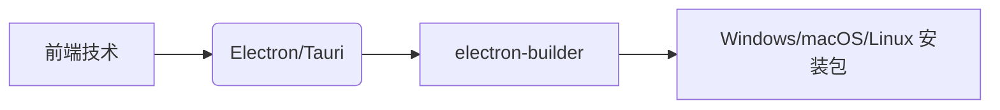
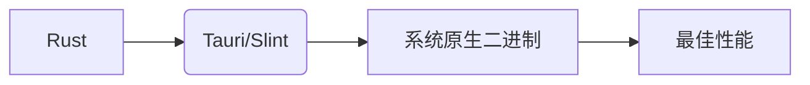
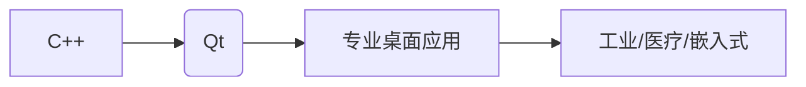

<!--
 * @Description: 
 * @Author: xunzhaotech
 * @Email: luyb@xunzhaotech.com
 * @QQ: 1525572900
 * @Date: 2024-10-28 12:10:33
 * @LastEditTime: 2025-07-12 13:20:09
 * @LastEditors: xunzhaotech
-->
以下是当前主流的桌面端开发工具和技术栈，涵盖跨平台框架、原生开发工具及实用辅助工具：

---

### 一、跨平台开发框架
#### 1. **Electron**
- **语言**：JavaScript/HTML/CSS
- **特点**：基于 Chromium + Node.js，生态成熟
- **代表应用**：VS Code、Slack、Discord
- **官网**：https://www.electronjs.org

#### 2. **Tauri**
- **语言**：Rust (核心) + Web 前端
- **特点**：轻量级（应用体积比 Electron 小 10 倍），安全
- **优势**：内存占用低，支持系统原生控件
- **官网**：https://tauri.app

#### 3. **Flutter**
- **语言**：Dart
- **特点**：高性能跨平台（移动/桌面/Web），热重载
- **桌面支持**：Windows/macOS/Linux 稳定版
- **官网**：https://flutter.dev

#### 4. **Qt**
- **语言**：C++/Python（PyQt/PySide）
- **特点**：工业级框架，原生性能
- **使用场景**：专业级应用（如 AutoCAD, WPS）
- **官网**：https://www.qt.io

---

### 二、原生开发工具
#### Windows
1. **WinUI 3**  
   - 微软现代 UI 框架
   - 支持 Win11 Fluent Design
   - 项目模板：https://github.com/microsoft/WinUI-Gallery

2. **WPF**  
   - 成熟 .NET 桌面框架
   - 开发工具：Visual Studio

#### macOS
1. **SwiftUI**  
   - Apple 官方声明式 UI 框架
   - Xcode 开发环境

2. **AppKit**  
   - 传统 macOS 原生开发

#### Linux
1. **GTK** (GNOME 生态)
2. **Qt** (KDE 生态)

---

### 三、开发辅助工具
#### 1. 调试工具
| 工具 | 平台 | 特点 |
|------|------|------|
| **Electron Fiddle** | Electron | 快速原型开发 |
| **Snoop** | WPF | UI 元素检查器 |
| **Reveal** | macOS/iOS | UI 深度调试 |

#### 2. 安装包构建
| 工具 | 支持平台 | 打包格式 |
|------|----------|----------|
| **electron-builder** | Electron | exe/dmg/deb/rpm |
| **Wix Toolset** | Windows | MSI 安装包 |
| **create-dmg** | macOS | DMG 镜像 |

#### 3. 性能优化
- **Electron**：使用 V8 快照（electron-link）
- **Flutter**：AOT 编译
- **通用**：内存分析（Valgrind/Instruments）

---

### 四、新兴技术
1. **WebView2**  
   - 微软官方 Web 嵌入方案
   - 替代 Electron 的轻量级选择
   - 支持 Win10/Win11

2. **Neutralinojs**  
   - 轻量级替代 Electron（无 Node.js 依赖）
   - 官网：https://neutralino.js.org

3. **Slint**  
   - Rust 原生 GUI 框架
   - 声明式 UI 语法
   - 官网：https://slint.dev

---

### 五、工具链推荐组合
#### 快速开发方案

#### 高性能方案

#### 企业级方案

---

### 六、学习资源
1. **Electron 官方文档**：https://electronjs.org/docs
2. **Tauri 实战教程**：https://tauri.app/v1/guides/
3. **Flutter 桌面开发**：https://docs.flutter.dev/desktop
4. **Qt 入门教程**：https://doc.qt.io/qt-6/gettingstarted.html

---

> **选择建议**：  
> - 追求开发速度：**Electron/Tauri**  
> - 需要原生性能：**Qt/Rust**  
> - 统一移动/桌面：**Flutter**  
> - 企业级 Windows 应用：**WinUI 3/WPF**  
> - 轻量级工具类应用：**Tauri/Neutralinojs**